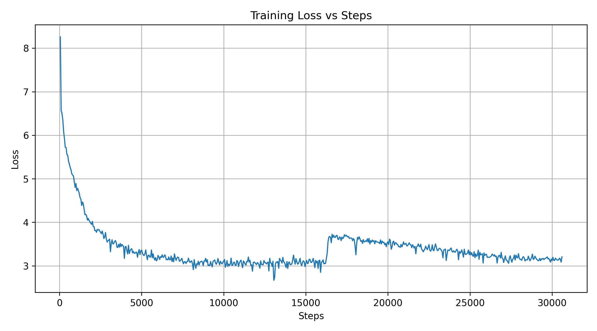

# Qwen3-0.6b Pretraining

A large language model pretraining framework ### 3. Data Preparation

Use the multi-corpus data processing script with the trained tokenizer:

```bash
# Process multiple corpora and generate training data
python scripts/prepare_multi_corpus.py \
    --config configs/data/multi_corpus.yaml \
    --tokenizer_path tokenizers/qwen3_tokenizer \
    --output_dir data/processed
```

### 4. Train Modelrch and Hugging Face Transformers, supporting distributed training, mixed precision training, and efficient data processing.

## Project Overview

This project implements a complete language model pretraining pipeline with the following core features:

- **Multiple Training Modes**: Support for debug mode training and distributed accelerated training
- **Efficient Data Processing**: Multi-corpus streaming processing with Arrow format storage
- **Performance Optimization**: Mixed precision training, gradient checkpointing, DeepSpeed integration
- **Evaluation Benchmarks**: Perplexity calculation and generation performance benchmarking
- **Flexible Configuration**: Modular configuration system supporting different model scales

## Project Structure

```
Qwen3-0.6b_pretrain/
├── scripts/           # Training and evaluation scripts
├── configs/           # Configuration files
├── src/              # Core source code
├── data/             # Dataset directory
├── environment.yml   # Conda environment configuration
└── README.md         # Project documentation
```

## Environment Setup

### 1. Create Conda Environment

```bash
conda env create -f environment.yml
conda activate qwen3pretrain
```

### 2. Install Dependencies

The environment includes the following main dependencies:
- **PyTorch 2.5.0** (CUDA 12.1 support)
- **Transformers** (Model architecture and pretraining modules)
- **Accelerate** (Distributed training framework)
- **DeepSpeed** (Memory optimization and distributed training)
- **Datasets** (Data processing)
- **tiktoken/sentencepiece** (Tokenizers)

## Quick Start

### 1. Prepare Corpus

First, prepare the corpus from raw data sources:

```bash
# Prepare temporary corpus from various data sources
python scripts/prepare_tmp_corpus.py \
    --out data/raw/tmp_corpus.txt \
```

### 2. Train Tokenizer

Train a tokenizer on the prepared corpus:

```bash
# Train tokenizer from prepared corpus
python scripts/train_tokenizer.py \
    --input data/raw/tmp_corpus.txt \
    --vocab_size 32000 \
    --output_dir tokenizer
```

### 3. Data Preparation

Use the multi-corpus data processing script with the trained tokenizer:

```bash
# Process multiple corpora and generate training data
python scripts/prepare_multi_corpus.py \
    --target_tokens 9e9 \
    --shard_tokens 1e8 \
    --out_dir data/processed \
    --tokenizer_dir tokenizer \
    --mix "wiki_en=0.55,rpjv2_small_en=0.2,wiki_zh=0.15,wiki_tw=0.05,stackoverflow_en=0.05"
```

```bash
# Packed training data
python scripts/make_packed_dataset.py \
    --arrow_dir data/processed/rpjv2_3B_arrow \
    --out_dir   data/packed/rpjv2_s2048 \
    --seq_len   2048 \
    --shard_tokens 50000000
```

### 4. Train Model

#### Distributed Training (Multi-GPU)

```bash
# Launch distributed training with Accelerate
scripts/run_deepspeed.sh
```

### 5. Plot training curve

```bash
python scripts/plot_loss.py \
    --log logs/train_qwen3_0.6b.log \
    --csv results/loss.csv
```


### 6. Model Evaluation
#### Quick inference

```bash
python scripts/quick_infer.py \
    --ckpt checkpoints/qwen3_0p6b/step-00030600 \
    --tokenizer tokenizer \
    --prompt "Write a short poem about stars." \
    --max_new_tokens 128
```

#### Perplexity Evaluation

```bash
python scripts/eval_ppl.py \
    --ckpt checkpoints/qwen3_0p6b/step-00030600 \
    --dataset wikitext \
    --subset wikitext-2-raw-v1 \
```

#### Generate sanity

```bash
python scripts/sanity_generate.py \
    --ckpt checkpoints/qwen3_0p6b/step-00030600 \
    --out results/sanity_outputs.jsonl
```

#### Inference performance and video memory monitoring
```bash
python scripts/bench_generate.py \
    --ckpt checkpoints/qwen3_0p6b/step-00030600 \
    --prompt "Hello, world!"
```

## Core Components

### Training Scripts

| Script | Purpose | Features |
|--------|---------|----------|
| `train_debug.py` | Debug training | Manual mixed precision, detailed logging |
| `train_accel.py` | Distributed training | Accelerate framework, automatic device management |

### Data Processing

- **streaming_dataset.py**: Streaming dataset processing, supporting large-scale corpora
- **packed_ds.py**: Load the packaged NPZ file
- **prepare_multi_corpus.py**: Multi-corpus preprocessing and token budget control

### Evaluation Tools

- **eval_ppl.py**: Calculate model perplexity on test sets.
- **bench_generate.py**: Monitor the inference performance and video memory.
- **sanity_generate.py**: Check whether the output is coherent and grammatically correct. Assess whether there is frequent repetition (a higher distinct-1/2 score indicates better diversity). Examine whether there is any abnormal punctuation or garbled text, especially when mixing Chinese and English.

### Configuration System

```
configs/
├── model/           # Model architecture configuration
├── train/           # Training parameter configuration  
├── deepspeed/       # DeepSpeed optimization configuration
└── accelerate/      # Accelerate distributed configuration
```

## Configuration Examples

### Model Configuration Example (model_debug.json)

```json
{
    "model_type": "llama",
    "vocab_size": 32000,
    "hidden_size": 768,
    "num_hidden_layers": 12,
    "num_attention_heads": 12,
    "max_position_embeddings": 2048
}
```

### Training Configuration Example (debug.yaml)

```yaml
# Data configuration
data_dir: "data/processed"
train_micro_batch_size_per_gpu: 4
gradient_accumulation_steps: 8

# Optimizer configuration
learning_rate: 2e-4
weight_decay: 0.01
betas: [0.9, 0.95]

# Training configuration
max_steps: 10000
warmup_steps: 1000
bf16: true
gradient_checkpointing: true

# Save and evaluation
save_interval: 1000
eval_interval: 500
logging_interval: 10
```

## Performance Optimization

### Memory Optimization Strategies

1. **Mixed Precision Training**: Use BF16 to reduce memory usage
2. **Gradient Checkpointing**: Trade computation for memory
3. **DeepSpeed ZeRO**: Distributed memory optimization
4. **Gradient Accumulation**: Simulate large batch training on small batches

### Training Acceleration Techniques

1. **TF32 Optimization**: Automatically enable CUDA matrix operation acceleration
2. **DataLoader Optimization**: Multi-process data loading and prefetching
3. **Compilation Optimization**: Use torch.compile for model acceleration
4. **Efficient Tokenization**: Preprocess data to avoid online tokenization

## Monitoring and Debugging

### Training Monitoring

- Real-time loss curves and learning rate scheduling
- GPU memory usage monitoring
- Training throughput statistics
- Gradient norm checking

### Debugging Features

- Detailed training log output
- Model weights and gradient inspection
- Data loading performance analysis
- Memory leak detection

## Results

This section shows the performance and output examples of our trained Qwen3-0.6b model across different evaluation metrics and inference tasks.

### Training loss curve



### Quick Inference Results

Quick inference test on sample prompts:

```
Input: "Write a short poem about stars."
Output: "Write a short poem about stars . In fact , I wanted to write about the effects of the mon ot ony and the role of the ancient Gree ks in the modern world . But it was quite complicated : even if we were creating a story that didn ’ t get published in print in the 1970s , we would have been able to do what we could to survive in the same place . So we had to move on – there were different ways that we could turn the myth into a narrative . The words came from the Greek word for sky , which is derived from the Greek word for the star , and the Greek word for the hero . It was also known as the Ancient Greek"
```

### Perplexity Evaluation Results

Model performance on standard benchmarks:

```
Dataset: wikitext-2-raw-v1
Perplexity: 34.96821452930913
```

### Sanity Generation Results

Basic text generation quality check:

```json
{"prompt:": "Write a short poem about stars.", "output": "Write a short poem about stars . In fact , I wanted to write about the effects of the mon ot ony and the role of the ancient Gree ks in the modern world . But it was quite complicated : even if we were creating a story that didn ’ t get published in print in the 1970s , we would have been able to do what we could to survive in the same place . So we had to move on – there were different ways that we could turn the myth into a narrative . The words came from the Greek word for sky , which is derived from the Greek word for the star , and the Greek word for the hero . It was also known as the Ancient Greek", "sec": 7.4544, "distinct_1": 0.6518518518518519, "distinct_2": 0.9029850746268657}
{"prompt:": "Explain the theory of relativity in simple terms.", "output": "Ex plain the theory of rel ativity in simple terms . In other words , if you can ' t get it right ( and I don ' t know how many times people get it wrong ), then you have to look at all the possible solutions . I do think that the best way to solve this problem is to have an answer . I hope you understand the method I used and this way of solving it . If you are going to be a bit more accurate about the process of making statements like \" it ' s not necessarily what you want \". And if you are going to be willing to try it , then you should have a real opportunity to start doing what you want . Some one please explain what", "sec": 5.3217, "distinct_1": 0.6474820143884892, "distinct_2": 0.9202898550724637}
{"prompt:": "What are the benefits of regular exercise?", "output": "What are the benefits of regular exercise ? I don ' t know , but it seems to me that exercise is a technique for dealing with stress , not just a place for a stress ful one . It ' s also used in men ' s and women ' s exercise . They have to use physical activity as a way to keep the stress level up . I don ' t think it works , unless there ' s something else you can do that ' s necessary . But I think if you have physical activity you need to have a healthy exercise plan . You ' re not going to get any benefit from exercise if you don ' t have physical activity ( which is a very good thing ).", "sec": 5.3314, "distinct_1": 0.5808823529411765, "distinct_2": 0.8962962962962963}
{"prompt:": "Describe a futuristic city.", "output": "Des cri be a fut ur istic city . It is also a little more complex than the first city , with many streets and streets being built around the city center . The main street and the pedestrian road from the east to the west , are divided into four sections , each of which has some traffic lights . There are three streets in this section , as well as another section , built on the western side of the street , called the \" C oney Island \". They consist of many small buildings and structures . At the eastern end of the street there is a tri angle with the central square , with several large buildings , called the \" Col um bo Theatre \". The Col um bo Theatre was constructed", "sec": 5.3281, "distinct_1": 0.6277372262773723, "distinct_2": 0.9264705882352942}
```

### Generation Performance Benchmark

Comprehensive performance metrics:

```
avg_latency_s=5.237  avg_tokens_per_s=24.4
peak_cuda_mem_GB=0.31
```


## FAQ

### Q: How to adjust model size?
A: Modify configuration files in `configs/model/`, main parameters include `hidden_size`, `num_hidden_layers`, `num_attention_heads`.

### Q: How to handle OOM issues?
A: Try the following strategies:
1. Reduce `train_micro_batch_size_per_gpu`
2. Increase `gradient_accumulation_steps`
3. Enable `gradient_checkpointing`
4. Use DeepSpeed ZeRO

### Q: How to add new datasets?
A: Add new data source configurations in `scripts/prepare_multi_corpus.py`, supporting JSONL, Parquet and other formats.

## Contributing

1. Fork the project repository
2. Create a feature branch
3. Commit code changes
4. Push to the branch
5. Create a Pull Request

## License

This project is licensed under the MIT License. See LICENSE file for details.

## Contact

For questions or suggestions, please submit an Issue or contact the project maintainers.